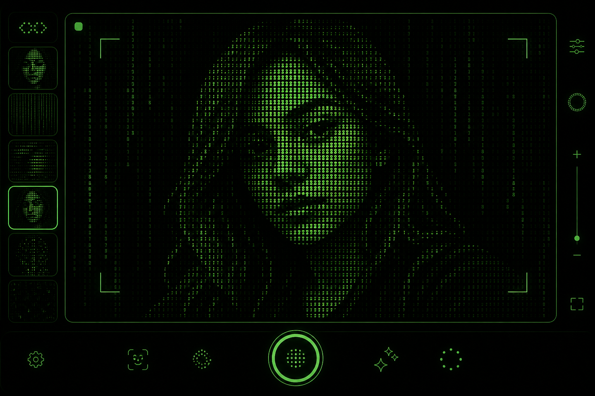
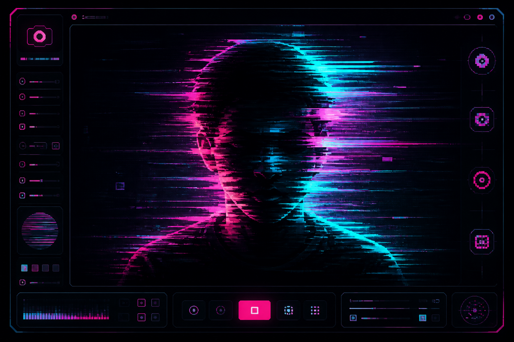
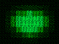

# ASCII / Glitch — видеофильтр

Два фильтра в одном: поток с веб-камеры превращается в **ASCII-арт в стиле «Матрица»** или в **киберпанк-глитч** (пиксельная сортировка + сдвиг RGB). Короткую петлю можно записать в WebM или GIF и скачать — удобно для аватарок и сториз.





<p align="center">
  
</p>

## Возможности

- Захват видео с веб-камеры (`getUserMedia`)
- Фильтр **Матрица** — блоки яркости → символы разной плотности, зелёный на чёрном
- Фильтр **Глитч** — сортировка пикселей, сдвиг каналов, полосы артефактов
- Ползунок **«Сила эффекта»** (0–100%)
- Запись короткой петли (~3 сек) в **WebM** (MediaRecorder) или **GIF**
- **Свайп влево** — Матрица, **свайп вправо** — Киберпанк (также кнопки и стрелки ← →)
- Настройки сохраняются в LocalStorage
- Тяжёлая обработка — в **Web Worker**
- Без бэкенда, без API-ключей, без `.env`

## Стек

Canvas · MediaRecorder · getUserMedia · Web Workers · TypeScript · Vite · Vitest · Playwright

## Быстрый старт

```bash
npm install
npm run dev
```

Откройте адрес из терминала (обычно http://localhost:5273). Разрешите доступ к камере.

> Камера работает на `localhost` или по HTTPS.

### Сборка

```bash
npm run build
npm run preview
```

### Тесты

```bash
npm test
```

E2E (нужен установленный Playwright):

```bash
npx playwright install chromium
npm run test:e2e
```

Все сразу:

```bash
npm run test:all
```

## Как пользоваться

1. Нажмите **«Включить камеру»** и разрешите доступ.
2. Выберите режим **Матрица** или **Глитч** (или свайпните по превью).
3. Настройте **силу эффекта**.
4. Выберите формат **WebM** или **GIF**, нажмите **«Записать»** (≈3 секунды).
5. Нажмите **«Скачать»**.

## Структура проекта

```
src/
  app/           — точка сборки UI и цикл кадров
  camera/        — getUserMedia
  filters/       — ASCII и Glitch (чистая бизнес-логика)
  workers/       — Web Worker + мост
  recorder/      — MediaRecorder + GIF-энкодер
  ui/            — свайпы, тосты
  utils/         — логгер, ошибки, LocalStorage
  styles/        — mobile-first CSS
tests/
  unit/          — Vitest
  e2e/           — Playwright
docs/            — скриншоты и GIF для README
```

## Монетизация (идеи)

- Готовый модуль фильтра для продажи / встраивания в сториз-редакторы
- Генератор аватарок и коротких лупов для соцсетей
- White-label пресеты «Матрица / Киберпанк»

## Доступность

- Семантическая вёрстка, `lang="ru"`
- `aria-label` / `aria-live` / `role="status"`
- Skip-link, фокус-стили, контраст зелёный/чёрный
- `prefers-reduced-motion`

## Лицензия

MIT — используйте свободно в личных и коммерческих проектах.
